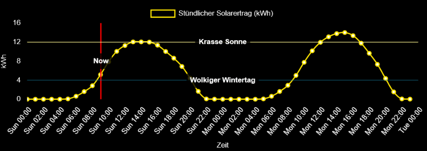

# MMM-evcc-SolarYield 🌞📊

A MagicMirror² module that displays your solar energy production in a beautiful hourly graph, powered by your EVCC API data!



## Features ✨

- 📈 **Hourly solar production** – Shows kWh produced each hour (not cumulative)
- 🔄 **Auto-updating** – Regularly fetches fresh data from your EVCC system
- 🎨 **Customizable** – Choose between line or bar chart styles
- 🌙 **Dark mode friendly** – Designed to match MagicMirror's aesthetic
- ⏱️ **48-hour view** – Shows all hours even with no production
- 🔧 **Easy configuration** – Just point it to your EVCC API endpoint

## Installation 📥

1. Navigate to your MagicMirror `modules` directory:
    ```bash
    cd ~/MagicMirror/modules
    ```
2. Clone this repository:
    ```bash
    git clone https://github.com/Coernel82/MMM-evcc-SolarYield.git
    ```
3. Install the module:
    ```bash
    cd MMM-evcc-SolarYield
    npm install
    ```

4. Future updates:
   ```bash
   git pull
   ```

## Configuration ⚙️

Add the module to your `config.js` file:
```javascript
{
  module: "MMM-evcc-SolarYield",
  position: "top_right",  // Any position you prefer
  config: {
     api_url: "http://192.168.178.28:7070/api/tariff/solar",  // Your EVCC API endpoint
     updateInterval: 300000,  // 5 minutes (in milliseconds)
     height: 250,  // Graph height
     width: 400,   // Graph width
     lineColor: "rgba(255, 165, 0, 1)",  // Orange line
     fillColor: "rgba(255, 165, 0, 0.2)",  // Light orange fill
     tension: 0.4,  // Line smoothness (0-1)
     chartType: "line",  // "line" or "bar"
     xAxisLabel: 'Zeit',
     horizontalLines: [{ value: 12, label: "Krasse Sonne", color: "rgb(255, 248, 146)" }, { value: 4, label: "Wolkiger Wintertag", color: "rgba(20, 119, 150, 0.69)" }],
  }
}
```

## Customization 🎨

You can customize the appearance by modifying these CSS properties in `MMM-evcc-SolarYield.css`:
```css
.solar-graph {
  padding: 10px;
  border-radius: 10px;
  background: rgba(0, 0, 0, 0.3);  /* Background opacity */
  backdrop-filter: blur(5px);      /* Glass effect intensity */
}
```

## Troubleshooting 🛠️

- **No data showing?**
  - Check your browser's developer console (F12) for errors.
  - Verify your API endpoint is correct and accessible.
- **Graph looks strange?**
  - Try adjusting the `tension` value (0 for straight lines, 1 for very curved).
  - Consider changing `chartType` to `"bar"` if lines are confusing.
- **Not updating?**
  - Increase the `updateInterval` if your system is resource-constrained.

## Dependencies 📦

- [Chart.js](https://www.chartjs.org/) (auto-installed)
- [MagicMirror²](https://magicmirror.builders/)
- [evcc](https://evcc.io) (something around version 0.204.3 and upwards as we need the API with solar data)

## Contributing 🤝

Pull requests are welcome! For major changes, please open an issue first to discuss what you'd like to change.

## License 📄

This project is licensed under the MIT License – see the LICENSE file for details.